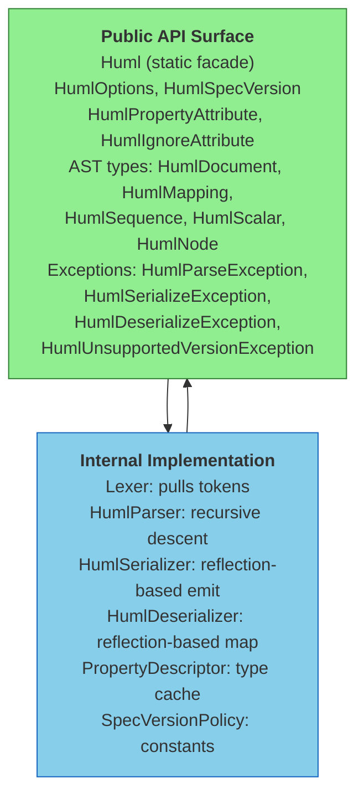
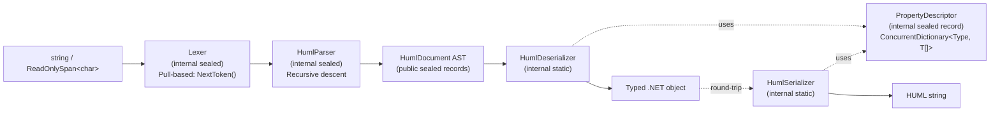
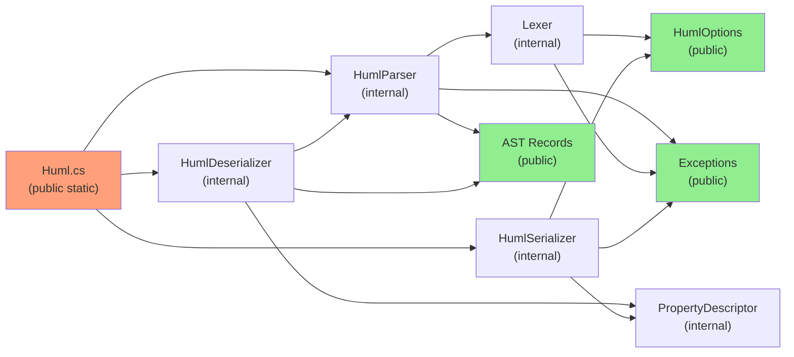
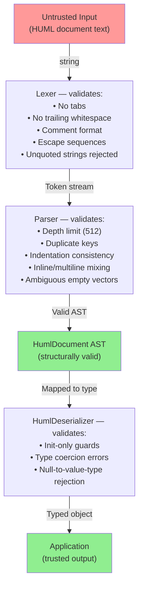

# Architecture Review Report

**Generated**: 2026-03-21 14:00:00
**Scope**: Full Review — Huml.Net library (single-assembly NuGet package)
**Reviewer**: Claude Code (claude-sonnet-4-6)
**Repository**: Shade666/huml-dotnet

---

## Executive Summary

### Overall Architecture Health Score: 80/100 (Grade: B)

| Dimension                    | Score | Status        | Priority |
| ---------------------------- | ----- | ------------- | -------- |
| System Structure             | 16/20 | 🟡 Fair      | Medium   |
| Design Patterns              | 15/20 | 🟡 Fair      | Medium   |
| Dependency Architecture      | 15/15 | 🟢 Excellent | Low      |
| Data Flow & State Management | 10/15 | 🟡 Fair      | High     |
| Scalability & Performance    | 11/15 | 🟡 Fair      | Medium   |
| Security Architecture        | 13/15 | 🟢 Good      | Low      |

**Key Findings** (Top 5):

1. ✅ **Strength**: Zero runtime dependencies — the library is entirely self-contained with only build-time tooling (MinVer, SourceLink), making it trivially embeddable and eliminating supply-chain risk.
2. ✅ **Strength**: Disciplined TDD — 577 tests across 3 TFMs with allocation tests and shared spec-compliance fixture suites.
3. 🔴 **Critical**: Versioning subsystem is declared but disconnected — `VersionSource.Header`, `UnknownVersionBehaviour`, and `HumlUnsupportedVersionException` are fully implemented types that are **never evaluated at runtime**. The parser silently discards the `%HUML` version token without validation.
4. ⚠️ **Concern**: `Deserialize<T>(ReadOnlySpan<char>)` is documented as enabling "zero-allocation parsing paths" but immediately calls `.ToString()`, allocating a managed string. The public API contract is misleading.
5. ⚠️ **Concern**: `HumlDocument` node type is semantically overloaded — it serves triple duty as root document, inline dict, and empty dict result, creating ambiguity in the AST.

**Recommended Focus Areas** (in priority order):

1. [🔴 HIGH] Implement version-header parsing and `UnknownVersionBehaviour` dispatch — Est. 2 days
2. [🟡 MEDIUM] Fix `ReadOnlySpan<char>` overload — either remove the string copy or update documentation — Est. 0.5 days
3. [🟡 MEDIUM] Introduce `HumlMappingDocument` or rename to disambiguate `HumlDocument` dual usage — Est. 1 day
4. [🟡 MEDIUM] Deduplicate `SerializeSequenceInline` / `SerializeSequenceBody` — Est. 0.5 days
5. [🟢 LOW] Cache `GetDefaultValue` results in `PropertyDescriptor` — Est. 0.5 days

---

## 1. System Structure Assessment

### 1.1 Component Hierarchy



**Key observation**: This is a single-assembly NuGet library, not a multi-project application. The architectural layers are expressed via C# `internal` access modifiers rather than separate assemblies. All pipeline classes (`Lexer`, `HumlParser`, `HumlSerializer`, `HumlDeserializer`, `PropertyDescriptor`, `SpecVersionPolicy`) are `internal sealed`, with only the public facade, AST nodes, option types, attributes, and exceptions being exposed.

**Findings**:

- ✅ Public API surface is correctly minimal: 1 static facade class + option types + attributes + exceptions + read-only AST records.
- ✅ All implementation classes (`Lexer`, `HumlParser`, `HumlSerializer`, `HumlDeserializer`, `PropertyDescriptor`) are `internal sealed` — correct encapsulation.
- ✅ `InternalsVisibleTo` is used only for the test project — no leakage to other consumers.
- ⚠️ Exception namespace is **inconsistent**: `HumlParseException`, `HumlSerializeException`, `HumlDeserializeException` live in `Huml.Net.Exceptions`, but `HumlUnsupportedVersionException` lives in `Huml.Net.Versioning.Exceptions`. Consumers must import two namespaces to handle all exceptions.
- ⚠️ `HumlDocument` node type is semantically overloaded — see §1.2.

### 1.2 Semantic Overloading of `HumlDocument`

`HumlDocument` is used in three distinct, unrelated contexts across the parser:

| Usage                | Location                             | Semantics                |
| -------------------- | ------------------------------------ | ------------------------ |
| Root document result | `HumlParser.Parse()`                 | The parsed document root |
| Inline dict result   | `ParseInlineDict()` → `HumlDocument` | A `{ }` inline mapping   |
| Empty dict result    | `RootType.EmptyDict` branch          | An explicitly empty `{}` |

This means a consumer calling `Huml.Parse()` who inspects the AST cannot distinguish between "the document has no root key" and "a key's value is an inline empty dict" without examining the parent context. In YAML terms, this conflates `Mapping` and `Document`.

```csharp
// ❌ Ambiguous: both of these produce HumlDocument with 0 entries
Huml.Parse("{}");                    // root empty dict
// vs
var doc = Huml.Parse("key::\n  {}"); // nested empty dict
```

**Recommendation**: Introduce a distinct `HumlMappingDocument` or rename the multi-role type. The root document wrapper is the one place `HumlDocument` is semantically correct; inline dicts should be `HumlMapping`-like nodes.

### 1.3 Internal Pipeline Architecture



### 1.4 Layered Design Compliance

| Layer                  | Compliance | Issues Found                                               |
| ---------------------- | ---------- | ---------------------------------------------------------- |
| Public API (`Huml.cs`) | 100% ✅    | None — clean delegation                                    |
| Versioning types       | 90% ⚠️   | `UnknownVersionBehaviour` never evaluated                  |
| Parser (`HumlParser`)  | 95% ✅     | `InferDictRootType` always returns `MultilineDict` (minor) |
| Lexer                  | 95% ✅     | Recursive `MeasureIndent`                                  |
| Serialization          | 90% ⚠️   | Duplicated sequence logic; `GetDefaultValue` not cached    |
| Exceptions             | 85% ⚠️   | Namespace split                                            |

---

## 2. Design Pattern Evaluation

### 2.1 Identified Patterns

| Pattern                    | Location                | Quality      | Notes                                                                |
| -------------------------- | ----------------------- | ------------ | -------------------------------------------------------------------- |
| Static Facade              | `Huml.cs`               | ✅ Excellent | Clean `System.Text.Json`-mirror; all 6 overloads XML-documented      |
| Pull-based Lexer           | `Lexer.cs`              | ✅ Excellent | O(n), single allocation per token value, no backtracking             |
| Recursive-Descent Parser   | `HumlParser.cs`         | ✅ Good      | Clean depth guard; `InferDictRootType` is a naming oddity            |
| Immutable AST              | `Parser/*.cs`           | ✅ Excellent | Sealed records give value equality and structural immutability       |
| Type Descriptor Cache      | `PropertyDescriptor.cs` | ✅ Good      | Thread-safe via `ConcurrentDictionary`; base-first declaration order |
| Version Policy Constants   | `SpecVersionPolicy.cs`  | ✅ Good      | Constants as code prevents message drift                             |
| Two-token Lookahead Buffer | `HumlParser._pending`   | ⚠️ Partial | Used in only one code path; misleading comment calls it a "buffer"   |

### 2.2 Anti-Patterns Detected

#### 🟡 Anti-Pattern 1: Trivial Delegation Wrapper

`SerializeDictionaryInline` in `HumlSerializer.cs:334` is a one-line wrapper that adds no value:

```csharp
// ❌ ANTI-PATTERN: Trivial wrapper in HumlSerializer.cs:334-341
private static void SerializeDictionaryInline(
    StringBuilder sb, IDictionary dict, int depth, HumlOptions options)
{
    SerializeDictionaryBody(sb, dict, depth, options); // literally just this
}
```

The wrapper exists because the original design distinguished "inline dict encountered as a root value" from "dict body under a `::` key" — but the indentation logic is identical for both. The wrapper should be removed and call sites should call `SerializeDictionaryBody` directly.

#### 🟡 Anti-Pattern 2: Near-Identical Methods

`SerializeSequenceInline` (line 254) and `SerializeSequenceBody` (line 293) in `HumlSerializer.cs` are functionally identical except for their parameter type (`IEnumerable` vs `List<object?>`). The internal loop logic, branch structure, and unsupported-type guard are copy-pasted:

```csharp
// ❌ DUPLICATED: Both methods share 85% identical logic
// SerializeSequenceInline (line 254) takes IEnumerable
// SerializeSequenceBody (line 293) takes List<object?>

// ✓ RECOMMENDED: Extract shared logic
private static void EmitSequenceItems(
    StringBuilder sb, IEnumerable<object?> items, int depth, HumlOptions options)
{
    // ... single implementation ...
}
```

#### 🟡 Anti-Pattern 3: Method Name Mismatch

`HumlParser.InferDictRootType()` (line 190) always returns `RootType.MultilineDict` regardless of input. The method body is a 30-line comment explaining why it defers to `ParseMappingEntries` for inline detection. The method exists for future extensibility but its name (`InferDict**RootType**`) implies it makes a decision that it doesn't actually make:

```csharp
// ❌ MISLEADING: InferDictRootType doesn't actually infer — always returns MultilineDict
private RootType InferDictRootType()
{
    // ... 30-line comment ...
    return RootType.MultilineDict; // always
}
```

**Recommendation**: Either inline the `return RootType.MultilineDict` at the call site with a short comment, or rename to `GetDictRootType_AlwaysMultiline()`.

### 2.3 Pattern Consistency

**Two-token lookahead**: The parser uses a `_pending`/`_hasPending` buffer pattern (lines 244–268) that is only exercised in `InferScalarOrInlineListRootType`. The comment describes it as a "two-item lookahead buffer" but only one token can be held. This is correct but the comment overstates the capability.

**Version gating convention**: The `>=` version comparison convention is established (`_options.SpecVersion >= HumlSpecVersion.V0_2`) and consistently used in the lexer. However, the parser's version gate placeholder comment on line 72–74 is dead code that should either be removed or activated.

---

## 3. Dependency Architecture

### 3.1 Dependency Graph



### 3.2 Coupling Analysis

**Afferent Coupling (Ca)** — how many modules depend on this:

| Module               | Ca                                          | Assessment                    |
| -------------------- | ------------------------------------------- | ----------------------------- |
| `HumlOptions`        | 4 (Lexer, Parser, Serializer, Deserializer) | ✅ Expected for options class |
| `HumlParseException` | 3 (Lexer, Parser, Deserializer)             | ✅ Expected                   |
| AST Records          | 3 (Parser, Deserializer, Serializer)        | ✅ Expected                   |
| `PropertyDescriptor` | 2 (Serializer, Deserializer)                | ✅ Correct sharing            |

**Efferent Coupling (Ce)** — how many modules this depends on:

| Module               | Ce  | Instability (Ce/Ca+Ce) | Assessment                       |
| -------------------- | --- | ---------------------- | -------------------------------- |
| `Huml.cs` (facade)   | 5   | 0.83                   | ✅ Acceptable — facade is a leaf |
| `HumlParser`         | 4   | 0.67                   | ✅ Acceptable                    |
| `Lexer`              | 2   | 0.40                   | ✅ Stable                        |
| `PropertyDescriptor` | 1   | 0.33                   | ✅ Stable                        |

### 3.3 External Dependencies

```text
Runtime NuGet dependencies: ZERO ✅
Build-only dependencies:
  ✅ MinVer 7.0.0       — deterministic semantic versioning from git tags
  ✅ SourceLink 10.0.201 — debugger source linking for NuGet consumers

Test-only dependencies:
  ✅ xunit.v3 3.2.2             — modern xUnit with Theory/Fact
  ✅ Microsoft.NET.Test.Sdk 18.3.0
  ✅ xunit.runner.visualstudio 3.1.5
  ✅ AwesomeAssertions 9.4.0    — FluentAssertions fork (per project rules)
```

**Note on MinVer**: The library uses `MinVerTagPrefix = v`, which means versioning is driven entirely from git tags. The NuGet package version will be `0.0.0-alpha.0` until a `v*` tag is pushed. A CI pipeline to enforce tagging discipline should be part of Phase 08 (CI pipeline is listed as an active requirement).

### 3.4 Target Framework Strategy

The library targets `netstandard2.1;net8.0;net9.0;net10.0`. This is the correct strategy for a NuGet library:

- `netstandard2.1`: compat floor for `ReadOnlySpan<char>` in public API
- `net8.0`/`net9.0`/`net10.0`: TFM-optimised builds via NuGet resolution

✅ No `net6.0` or `net7.0` targets needed — both are end-of-life.
✅ `netstandard2.0` deliberately excluded (no `Span` support) — correct decision.

---

## 4. Data Flow Analysis

### 4.1 Parse Pipeline (Deserialisation Path)

```mermaid
sequenceDiagram
    participant Consumer
    participant Facade as Huml (facade)
    participant Parser as HumlParser
    participant Lexer
    participant Deser as HumlDeserializer
    participant Cache as PropertyDescriptor

    Consumer->>Facade: Deserialize&lt;T&gt;(string huml)
    Facade->>Deser: Deserialize&lt;T&gt;(span, options)
    Note over Deser: span.ToString() — allocates string ⚠️
    Deser->>Parser: new HumlParser(string, options)
    Parser->>Lexer: new Lexer(string, options)
    loop Per token
        Parser->>Lexer: NextToken()
        Lexer-->>Parser: Token
    end
    Parser-->>Deser: HumlDocument (AST)
    Deser->>Cache: GetDescriptors(typeof(T))
    Cache-->>Deser: PropertyDescriptor[]
    loop Per mapping entry
        Deser->>Deser: CoerceScalar / DeserializeDocument recursion
    end
    Deser-->>Facade: (T) instance
    Facade-->>Consumer: T
```

### 4.2 Serialisation Path

```mermaid
sequenceDiagram
    participant Consumer
    participant Facade as Huml (facade)
    participant Ser as HumlSerializer
    participant Cache as PropertyDescriptor
    participant SB as StringBuilder

    Consumer->>Facade: Serialize&lt;T&gt;(value)
    Facade->>Ser: Serialize(value, options)
    Ser->>SB: Append("%HUML vX.Y.Z\n")
    Ser->>Ser: SerializeValue(sb, value, depth=0)
    Ser->>Cache: GetDescriptors(typeof(T))
    Cache-->>Ser: PropertyDescriptor[]
    loop Per property
        Ser->>Ser: EmitEntry(sb, indent, key, value)
        Note over Ser: Recursive for nested POCOs
    end
    Ser-->>Facade: sb.ToString()
    Facade-->>Consumer: string
```

### 4.3 Critical Data Flow Gap: Version Header Not Evaluated

This is the most significant functional gap in the codebase.

**What is declared:**

```csharp
// HumlOptions.cs
public VersionSource VersionSource { get; init; } = VersionSource.Options;
public UnknownVersionBehaviour UnknownVersionBehaviour { get; init; } = UnknownVersionBehaviour.Throw;

// HumlOptions.AutoDetect
public static readonly HumlOptions AutoDetect = new()
{
    VersionSource = VersionSource.Header, // <-- reads version from document header
};
```

**What actually happens at runtime:**

```csharp
// HumlParser.Parse() — line 78
if (Peek().Type == TokenType.Version)
    Advance(); // ← token consumed and silently DISCARDED
```

The parser reads the `%HUML v0.2.0` header token and throws it away. The following logic is **never executed**:

- No reading of `VersionSource` option
- No comparison of declared version against `SpecVersionPolicy.MinimumSupported`/`Latest`
- No dispatch to `UnknownVersionBehaviour`
- `HumlUnsupportedVersionException` is **never thrown** by any code path

The `HumlOptions.AutoDetect` static instance is therefore a no-op — it behaves identically to `HumlOptions.Default` because version auto-detection is not implemented.

**Impact**: Any consumer who writes `Huml.Parse(input, HumlOptions.AutoDetect)` expecting version-aware parsing gets silently incorrect behaviour if the document contains a future unsupported version directive.

**Fix required** (see Phase 1 Roadmap):

```csharp
// HumlParser.Parse() — proposed fix
if (Peek().Type == TokenType.Version)
{
    var versionToken = Advance();
    if (_options.VersionSource == VersionSource.Header)
        ApplyVersionFromHeader(versionToken.Value!);
}

private void ApplyVersionFromHeader(string declaredVersion)
{
    // Map version string to HumlSpecVersion enum
    // Validate against SpecVersionPolicy.MinimumSupported / Latest
    // Dispatch UnknownVersionBehaviour (Throw / UseLatest / UsePrevious)
    // Update effective spec version for subsequent version gates
}
```

**Note**: `HumlOptions` uses `init`-only properties, so the effective spec version cannot be mutated on the existing options instance. The parser would need to store the effective version in a separate field (`_effectiveSpecVersion`) that shadows `_options.SpecVersion` when `VersionSource.Header` is active.

### 4.4 `ReadOnlySpan<char>` Overload Allocates a String

```csharp
// HumlDeserializer.cs:37
internal static T Deserialize<T>(ReadOnlySpan<char> huml, HumlOptions? options = null)
{
    var doc = new HumlParser(huml.ToString(), ...); // ← allocates managed string immediately
```

The public API documentation claims:

> `Deserialize<T>(ReadOnlySpan<char> huml, ...)` — "zero-allocation parsing paths"
> (`PROJECT.md` line 33, `Huml.cs` XML doc summary)

This is accurate for the **facade's delegation chain** (`Huml.Deserialize<T>(string)` → `AsSpan()` → span overload) but the span overload itself allocates immediately. The `ReadOnlySpan<char>` parameter is only meaningful today if the caller has a span that does not already have a backing string — which `AsSpan()` on a string does not improve.

The real benefit would come if the lexer accepted `ReadOnlySpan<char>` directly, avoiding the intermediate string. That would require `Lexer` to hold a `ReadOnlySpan<char>` instead of `string _source` — possible in .NET 8+ but requires a `ref struct` Lexer, which cannot be used in a generic context or stored in a field.

For now, either:

1. Update the documentation to be honest about the allocation, or
2. Track the zero-copy span path as a future enhancement

---

## 5. Scalability & Performance

### 5.1 Pipeline Performance Profile

| Operation                  | Complexity     | Notes                                                                           |
| -------------------------- | -------------- | ------------------------------------------------------------------------------- |
| Lexing                     | O(n)           | Single pass, minimal allocations (allocation tests verify < 1KB for small docs) |
| Parsing                    | O(n)           | Recursive descent; depth bounded by `MaxRecursionDepth`                         |
| `PropertyDescriptor` cache | O(1) amortised | One reflection scan per type, then `ConcurrentDictionary` lookup                |
| Serialisation              | O(n × p)       | n = nesting depth, p = property count per level                                 |
| Deserialisation            | O(n × p)       | Same                                                                            |

### 5.2 Identified Performance Issues

#### 🟡 Issue 1: `EscapeString` Allocates 4 Intermediate Strings

```csharp
// HumlSerializer.cs:395-402
private static string EscapeString(string s)
{
    s = s.Replace("\\", "\\\\");  // allocation 1
    s = s.Replace("\"", "\\\"");  // allocation 2
    s = s.Replace("\n", "\\n");   // allocation 3
    s = s.Replace("\t", "\\t");   // allocation 4
    return s;
}
```

Each `string.Replace` allocates a new string even if no replacement was made. For the common case (no special characters), all 4 calls allocate unnecessarily.

**Recommended pattern** for .NET 8+:

```csharp
// ✓ RECOMMENDED: Scan once, write directly into StringBuilder
private static void AppendEscapedString(StringBuilder sb, string s)
{
    foreach (char c in s)
    {
        switch (c)
        {
            case '\\': sb.Append("\\\\"); break;
            case '"':  sb.Append("\\\""); break;
            case '\n': sb.Append("\\n");  break;
            case '\t': sb.Append("\\t");  break;
            default:   sb.Append(c);      break;
        }
    }
}
```

This eliminates all intermediate allocations and integrates directly into the `StringBuilder` chain.

#### 🟡 Issue 2: `GetDefaultValue` Not Cached

```csharp
// HumlSerializer.cs:412-413
private static object? GetDefaultValue(Type t) =>
    t.IsValueType ? Activator.CreateInstance(t) : null;
```

This is called on **every property** during serialisation when `OmitIfDefault = true`. `Activator.CreateInstance(t)` for value types (e.g., `int`, `bool`, `Guid`) allocates a boxed value on every call. The result is deterministic per type and should be cached in `PropertyDescriptor` alongside the property metadata.

**Recommended fix**: Add `DefaultValue` to `PropertyDescriptor`:

```csharp
// ✓ RECOMMENDED: Compute once and cache in PropertyDescriptor
internal sealed record PropertyDescriptor(
    string HumlKey,
    PropertyInfo Property,
    bool OmitIfDefault,
    bool IsInitOnly,
    object? DefaultValue)   // ← add this field, set during BuildDescriptors
```

#### 🟡 Issue 3: Recursive `MeasureIndent` for Blank Lines

```csharp
// Lexer.cs:175
return MeasureIndent(); // recurse for next line
```

Each blank line adds one stack frame. A document with 500 consecutive blank lines would recurse 500 levels — approaching the default 512-level parser limit and potentially causing a `StackOverflowException` in the lexer before the parser's guard fires. An iterative rewrite is straightforward:

```csharp
// ✓ RECOMMENDED: Convert to iterative loop
private int MeasureIndent()
{
    while (true)  // loop instead of tail recursion
    {
        // ... existing logic ...
        if (isBlankLine)
        {
            _pos = p + 1;
            _line++;
            _col = 0;
            continue; // tail-call becomes continue
        }
        // ...
        return indent;
    }
}
```

### 5.3 Allocation Budget (Verified by Tests)

The `LexerAllocationTests` enforce:

- Hot-path ASCII document (key + string + int + bool): **< 1KB per lex pass** ✅
- Structural-only document (vector + list items): **< 1KB per lex pass** ✅

This is a strong property. The tests verify that structural tokens (`VectorIndicator`, `ListItem`, `Comma`, `ScalarIndicator`, `Eof`) produce null `Value` and thus allocate no string per token.

### 5.4 Multi-Target Build Performance

Building across 4 TFMs (`netstandard2.1;net8.0;net9.0;net10.0`) quadruples build time. Since `netstandard2.1` is the compat floor and `net8.0` is the oldest supported LTS runtime, consider whether `netstandard2.1` is still needed once `net8.0` becomes the universal baseline (around 2025-2026). This is a future decision point, not an immediate action.

---

## 6. Security Architecture

### 6.1 Trust Boundary Model



### 6.2 Security Properties

| Property                               | Status | Evidence                                                                    |
| -------------------------------------- | ------ | --------------------------------------------------------------------------- |
| No type embedding in format            | ✅     | HUML has no `$type` or `!!python/object` equivalent                         |
| No RCE via deserialisation             | ✅     | Target type always caller-specified, never document-driven                  |
| No unsafe code                         | ✅     | `AllowUnsafeBlocks` not enabled; no `unsafe`/`Marshal`/`IntPtr`             |
| Recursion depth guard                  | ✅     | `MaxRecursionDepth = 512` default, configurable                             |
| Input validation                       | ✅     | Tabs, trailing whitespace, unquoted strings, comment format all rejected    |
| No hardcoded secrets                   | ✅     | No API keys, tokens, or credentials in any file                             |
| Correct escape processing              | ✅     | Lexer validates escape sequences; unknown escapes throw                     |
| Reflection scoped to public properties | ✅     | `BindingFlags.Public \| BindingFlags.Instance \| BindingFlags.DeclaredOnly` |

### 6.3 Minor Observation: Version Validation Gap

Because `UnknownVersionBehaviour.Throw` is the default but is never evaluated (§4.3), a document claiming to be `%HUML v9.9.0` (a far-future unsupported version) would be silently parsed as v0.2 rather than throwing `HumlUnsupportedVersionException`. This could cause silent parsing failures for format-incompatible documents. This is a correctness/robustness issue rather than a direct security vulnerability.

---

## 7. Advanced Analysis

### 7.1 Testability Assessment

**Test Coverage (by file count)**:

| Component     | Test Files                                                                                                               | Notable Tests                             |
| ------------- | ------------------------------------------------------------------------------------------------------------------------ | ----------------------------------------- |
| Lexer         | `LexerTests.cs`, `LexerAllocationTests.cs`, `TokenTests.cs`, `TokenTypeTests.cs`                                         | Allocation budget tests — strong          |
| Parser        | `HumlParserTests.cs`, `HumlNodeTests.cs`, `ScalarKindTests.cs`                                                           | 24 parser scenarios                       |
| Serialization | `HumlSerializerTests.cs`, `HumlDeserializerTests.cs`, `PropertyDescriptorTests.cs`                                       | Round-trip coverage                       |
| Exceptions    | `HumlParseExceptionTests.cs`, `HumlSerializeExceptionTests.cs`, `HumlDeserializeExceptionTests.cs`                       | Contract tests                            |
| Versioning    | `HumlOptionsTests.cs`, `HumlSpecVersionTests.cs`, `SpecVersionPolicyTests.cs`, `HumlUnsupportedVersionExceptionTests.cs` | —                                         |
| Static API    | `HumlStaticApiTests.cs`                                                                                                  | 8 tests for all 6 overloads               |
| Fixture suite | `SharedSuiteTests.cs`                                                                                                    | 351 fixture assertions across v0.1 + v0.2 |

**Total: 577 tests across net8.0/net9.0/net10.0** ✅

**Testability strengths**:

- `PropertyDescriptor.ClearCache()` enables clean test isolation
- `InternalsVisibleTo` gives tests access to `internal` types without needing public exposure
- Fixture-driven testing ensures spec compliance beyond hand-written unit tests
- Allocation tests provide regression protection for the hot path

**Testability gaps**:

- No tests verify `VersionSource.Header` auto-detection (because the feature isn't implemented)
- No tests verify `UnknownVersionBehaviour.Throw` / `UseLatest` / `UsePrevious` at parse time
- No round-trip property tests (Serialize → Deserialize → assert equality)
- `Infrastructure/FixtureGuardTests.cs` — file exists but content not reviewed; purpose unclear from filename

### 7.2 Configuration Management

`HumlOptions` is a well-designed options class:

- `sealed` prevents subclassing
- `init`-only properties prevent post-construction mutation
- Two static singletons (`Default`, `AutoDetect`) cover the 90% case
- `MaxRecursionDepth` exposes the depth guard to consumers

One improvement: `HumlOptions` has no input validation. Setting `MaxRecursionDepth = 0` would reject every document (depth check fires on the first nesting level). Setting `MaxRecursionDepth = int.MaxValue` would defeat the stack overflow protection. A constructor or factory validation pattern would catch misconfiguration early.

### 7.3 Error Handling Patterns

The library uses a clean **exception-based** error model with three typed exceptions:

| Exception                         | Thrown by                 | Carries         |
| --------------------------------- | ------------------------- | --------------- |
| `HumlParseException`              | Lexer, Parser             | Line + Column   |
| `HumlDeserializeException`        | Deserializer              | Key + Line      |
| `HumlSerializeException`          | Serializer                | Message only    |
| `HumlUnsupportedVersionException` | — (never actually thrown) | DeclaredVersion |

All exceptions are `sealed`, preventing extension. The diagnostic properties (`Line`, `Column`, `Key`) on `HumlParseException` and `HumlDeserializeException` are valuable for IDE integrations and error reporting.

**Inconsistency**: `HumlDeserializeException` carries `Line` as `int?` (nullable) but the two-argument constructor always sets it. The nullable type is necessary for the one-argument constructor but could be confusing to consumers who always expect a line number.

### 7.4 Observability

The library has no logging or tracing integration — correct for a low-level parsing library. Consumers are expected to catch typed exceptions and log them. No observability action required.

### 7.5 NuGet Publish Readiness

Active requirements include:

- ✅ `PackageId`, `Description`, `Authors`, `PackageLicenseExpression`, `PackageTags` — set
- ✅ `PackageProjectUrl`, `RepositoryUrl` — set
- ✅ `GenerateDocumentationFile = true` — XML docs embedded in package
- ✅ `PackageReadmeFile` references `README.md` — file exists at repo root
- ⚠️ `PackageVersion` — driven by MinVer from git tags; no `v*` tag yet means version will be `0.0.0-alpha.0`
- ❌ CI pipeline — not yet implemented (active requirement)

---

## 8. Quality Metrics

### 8.1 Code Organisation Score: 88/100

| Metric                       | Score    | Details                                                                                 |
| ---------------------------- | -------- | --------------------------------------------------------------------------------------- |
| Namespace consistency        | 80% ⚠️ | Exception namespace split (`Huml.Net.Exceptions` vs `Huml.Net.Versioning.Exceptions`)   |
| File/class alignment         | 100% ✅  | One class per file throughout                                                           |
| Folder structure clarity     | 95% ✅   | `Lexer/`, `Parser/`, `Serialization/`, `Versioning/`, `Exceptions/` — logical groupings |
| Single responsibility        | 90% ✅   | Minor: `HumlDocument` overloaded; serializer has two near-identical sequence methods    |
| StyleCop/analyser compliance | 95% ✅   | Zero build warnings across 4 TFMs per commit history                                    |

### 8.2 Documentation Adequacy: 90/100

**Strengths**:

- ✅ All public API members have XML doc comments with param/returns/exception tags
- ✅ `PROJECT.md` is detailed and current — good ADR-like decision log
- ✅ Planning directory (`/.planning`) documents all phases with SUMMARY files

**Gaps**:

- ⚠️ `HumlOptions.AutoDetect` XML comment does not warn that `VersionSource.Header` auto-detection is not yet implemented
- ⚠️ `Deserialize<T>(ReadOnlySpan<char>)` XML doc says "zero-allocation" but the implementation allocates immediately via `huml.ToString()`

### 8.3 Technical Debt Inventory

| Category         | Item                                                | Effort    | Priority |
| ---------------- | --------------------------------------------------- | --------- | -------- |
| Functional gap   | Version header not parsed/validated                 | 2 days    | 🔴      |
| Misleading API   | `ReadOnlySpan<char>` overload allocates immediately | 0.5 days  | 🟡      |
| AST design       | `HumlDocument` overloaded semantics                 | 1 day     | 🟡      |
| Code duplication | `SerializeSequenceInline` / `SerializeSequenceBody` | 0.5 days  | 🟡      |
| Performance      | `EscapeString` allocates 4 intermediate strings     | 0.5 days  | 🟡      |
| Performance      | `GetDefaultValue` not cached                        | 0.5 days  | 🟡      |
| Correctness      | `MeasureIndent` recursive — replace with iteration  | 0.5 days  | 🟡      |
| Naming           | `InferDictRootType` always returns `MultilineDict`  | 0.5 days  | 🟢      |
| Naming           | `SerializeDictionaryInline` trivial wrapper         | 0.25 days | 🟢      |
| Namespace        | Exception namespace inconsistency                   | 0.5 days  | 🟢      |
| Validation       | `HumlOptions.MaxRecursionDepth` has no bounds check | 0.5 days  | 🟢      |
| CI/CD            | GitHub Actions pipeline not implemented             | 1 day     | 🟡      |

**Total Estimated Debt**: ~8.25 development days (~1.7 sprint weeks at 5 days/sprint)

---

## 9. Improvement Roadmap

### Phase 1: Implement Version Header Parsing (Priority: Critical) — Est. 2 days

**Goal**: Make `VersionSource.Header`, `UnknownVersionBehaviour`, and `HumlUnsupportedVersionException` functional.

- [ ] **Task 1.1**: Add `_effectiveSpecVersion` field to `HumlParser` (shadows `_options.SpecVersion` when `VersionSource.Header` is active)
  - **Files**: `src/Huml.Net/Parser/HumlParser.cs`
  - **Acceptance**: `HumlParser` stores effective version separately from options
  - **Effort**: 0.25 days

- [ ] **Task 1.2**: Implement `ApplyVersionFromHeader(string)` in `HumlParser`
  - Parse version string (`vX.Y.Z` → major/minor/patch)
  - Map to `HumlSpecVersion` enum (v0.1 → `V0_1`, v0.2 → `V0_2`)
  - Validate against `SpecVersionPolicy.MinimumSupportedVersion` / `LatestVersion`
  - Dispatch `UnknownVersionBehaviour`: `Throw` → throw `HumlUnsupportedVersionException`, `UseLatest` → set `V0_2`, `UsePrevious` → set closest earlier version
  - **Files**: `src/Huml.Net/Parser/HumlParser.cs`
  - **Acceptance**: All three `UnknownVersionBehaviour` cases handled and tested
  - **Effort**: 1 day

- [ ] **Task 1.3**: Wire `_effectiveSpecVersion` into lexer version gates
  - Backtick multiline check in lexer currently reads `_options.SpecVersion`; needs to read effective version
  - **Files**: `src/Huml.Net/Lexer/Lexer.cs`, `src/Huml.Net/Parser/HumlParser.cs`
  - **Acceptance**: Backtick multiline accepted for `v0.1` header, rejected for `v0.2` header
  - **Effort**: 0.5 days

- [ ] **Task 1.4**: Update `HumlOptions.AutoDetect` XML doc to document the feature
  - Update `HumlParser` parse method comment
  - **Files**: `src/Huml.Net/Versioning/HumlOptions.cs`
  - **Effort**: 0.25 days

- [ ] **Task 1.5**: Add tests for version header parsing
  - `VersionSource.Header` with matching version → succeeds
  - Unknown version + `Throw` → `HumlUnsupportedVersionException`
  - Unknown version + `UseLatest` → parses as latest
  - Unknown version + `UsePrevious` → parses as nearest supported
  - **Files**: `tests/Huml.Net.Tests/Versioning/`
  - **Effort**: 0.5 days

**Phase 1 Total**: 2.5 days

---

### Phase 2: Fix API Accuracy and AST Semantics (Priority: High) — Est. 2 days

**Goal**: Correct misleading public API contracts and disambiguate `HumlDocument`.

- [ ] **Task 2.1**: Fix or document `Deserialize<T>(ReadOnlySpan<char>)` allocation behaviour
  - Option A: Update XML doc comment to remove "zero-allocation" claim
  - Option B: Track as a `v2` backlog item (`ref struct` lexer required for true zero-copy)
  - **Files**: `src/Huml.Net/Huml.cs`, `src/Huml.Net/Serialization/HumlDeserializer.cs`
  - **Effort**: 0.25 days

- [ ] **Task 2.2**: Disambiguate `HumlDocument` from inline dicts
  - Consider introducing `HumlDictNode` (inline dict) vs keeping `HumlDocument` (root only)
  - This is an AST breaking change — affects public sealed record types
  - **Files**: `src/Huml.Net/Parser/*.cs`, `tests/`
  - **Effort**: 1 day

- [ ] **Task 2.3**: Fix exception namespace inconsistency
  - Move `HumlUnsupportedVersionException` to `Huml.Net.Exceptions` namespace to match siblings
  - This is a **breaking change** for any consumer already importing `Huml.Net.Versioning.Exceptions`
  - Emit an `[Obsolete]` type alias in `Huml.Net.Versioning.Exceptions` for one version cycle
  - **Files**: `src/Huml.Net/Versioning/Exceptions/HumlUnsupportedVersionException.cs`
  - **Effort**: 0.5 days

- [ ] **Task 2.4**: Add `HumlOptions` constructor validation
  - Throw `ArgumentOutOfRangeException` if `MaxRecursionDepth < 1 || MaxRecursionDepth > 65536`
  - **Files**: `src/Huml.Net/Versioning/HumlOptions.cs`
  - **Effort**: 0.25 days

**Phase 2 Total**: 2 days

---

### Phase 3: Performance and Code Quality Improvements (Priority: Medium) — Est. 2 days

**Goal**: Eliminate unnecessary allocations, remove duplication, fix naming issues.

- [ ] **Task 3.1**: Rewrite `EscapeString` to write directly into `StringBuilder`
  - **Files**: `src/Huml.Net/Serialization/HumlSerializer.cs:395`
  - **Effort**: 0.5 days

- [ ] **Task 3.2**: Cache `GetDefaultValue` in `PropertyDescriptor`
  - Add `object? DefaultValue` to `PropertyDescriptor` record
  - Compute in `BuildDescriptors` for `OmitIfDefault` properties
  - **Files**: `src/Huml.Net/Serialization/PropertyDescriptor.cs`, `HumlSerializer.cs`
  - **Effort**: 0.5 days

- [ ] **Task 3.3**: Convert `MeasureIndent` from recursive to iterative
  - **Files**: `src/Huml.Net/Lexer/Lexer.cs:143`
  - **Effort**: 0.5 days

- [ ] **Task 3.4**: Deduplicate `SerializeSequenceInline` and `SerializeSequenceBody`
  - Extract `EmitSequenceItems` shared helper
  - **Files**: `src/Huml.Net/Serialization/HumlSerializer.cs`
  - **Effort**: 0.25 days

- [ ] **Task 3.5**: Remove `SerializeDictionaryInline` trivial wrapper
  - Call sites replace with direct `SerializeDictionaryBody` calls
  - **Files**: `src/Huml.Net/Serialization/HumlSerializer.cs:334`
  - **Effort**: 0.25 days

**Phase 3 Total**: 2 days

---

### Phase 4: CI Pipeline and NuGet Release Prep (Priority: High — active requirement) — Est. 1.5 days

**Goal**: Satisfy the two remaining active requirements: NuGet metadata completeness and CI pipeline.

- [ ] **Task 4.1**: Set up GitHub Actions workflow
  - `dotnet build --configuration Release` across all TFMs
  - `dotnet test` across net8.0/net9.0/net10.0
  - **Files**: `.github/workflows/ci.yml`
  - **Effort**: 0.5 days

- [ ] **Task 4.2**: Add `PackageVersion` tag to trigger MinVer
  - `git tag v0.1.0-alpha.1` to produce meaningful NuGet version
  - Validate `dotnet pack` produces correct version
  - **Effort**: 0.25 days

- [ ] **Task 4.3**: Add `README.md` NuGet section for package consumers
  - Installation instructions, quick-start code sample, version support table
  - **Files**: `README.md`
  - **Effort**: 0.75 days

**Phase 4 Total**: 1.5 days

---

## 10. Conclusion

### 10.1 Architecture Maturity Assessment

**Overall Grade: B (80/100)** — A well-structured, professionally implemented library that demonstrates strong TDD discipline, clean API design, and thoughtful multi-targeting. The primary concern is a disconnected versioning subsystem that silently ignores declared spec versions, which will mislead consumers who use `HumlOptions.AutoDetect`. All other issues are quality improvements rather than blockers.

**Strengths to Preserve**:

1. ✅ **Zero runtime dependencies**: This is a standout property. The library can be embedded anywhere without supply-chain risk.
2. ✅ **Allocation budget tests**: The `LexerAllocationTests` enforce performance contracts in CI — a practice worth extending to the serializer.
3. ✅ **TDD + shared fixture compliance**: The `SharedSuiteTests` Theory runner against the canonical `huml-lang/tests` suite means spec compliance is an automatic CI gate, not a manual audit.
4. ✅ **Immutable AST**: Sealed records with value equality make the AST safe to share and compare without defensive copying.

**Critical Improvements Needed**:

1. 🔴 **Implement version header parsing**: `VersionSource.Header` / `UnknownVersionBehaviour` must be wired up before the library is published. Shipping with silently non-functional configuration options is a credibility risk.
2. 🟡 **Correct API documentation**: The `ReadOnlySpan<char>` overload's "zero-allocation" claim needs to be accurate.

### 10.2 Risk Assessment

| Risk                                                                                        | Likelihood                | Impact                                    | Mitigation Priority |
| ------------------------------------------------------------------------------------------- | ------------------------- | ----------------------------------------- | ------------------- |
| Consumer sets `AutoDetect`, receives silently wrong behaviour on future-versioned documents | Medium (common pattern)   | High (silent data loss / incorrect parse) | 🔴 Priority        |
| Consumer imports wrong exception namespace for `HumlUnsupportedVersionException`            | Medium                    | Low (compile error, easy to fix)          | 🟡 Priority        |
| `MeasureIndent` stack overflow on 500+ consecutive blank lines                              | Low (pathological input)  | Medium (process crash)                    | 🟡 Priority        |
| NuGet package ships without a CI pipeline — regressions go undetected                       | High (no pipeline exists) | High                                      | 🔴 Priority        |
| `EscapeString` performance regression under heavy string serialisation                      | Low                       | Low                                       | 🟢 Priority        |
| `MaxRecursionDepth = 0` silently rejects all documents                                      | Low (misconfiguration)    | Medium                                    | 🟢 Priority        |

### 10.3 Next Steps

**Immediate Actions** (This Week):

1. Implement version header parsing (Phase 1) — this is the only blocker to a trustworthy public API
2. Set up CI pipeline (Phase 4, Task 4.1) — don't publish without CI

**Before First NuGet Publish**:

1. Complete Phase 1 (version parsing)
2. Complete Phase 4 (CI + README)
3. Fix the `ReadOnlySpan<char>` documentation (Phase 2, Task 2.1)
4. Push `v0.1.0-alpha.1` tag to activate MinVer version computation

**Post-v1 / Backlog**:

1. `HumlDocument` semantic disambiguation (considered a breaking change for v2)
2. True zero-copy `ref struct` lexer for `ReadOnlySpan<char>` path (net8.0+ only)
3. Source generator support for AOT-compatible property resolution

---

## Appendix: File Reference Index

| File                                                                    | Lines | Role                                      |
| ----------------------------------------------------------------------- | ----- | ----------------------------------------- |
| `src/Huml.Net/Huml.cs`                                                  | 83    | Public static facade — single entry point |
| `src/Huml.Net/Lexer/Lexer.cs`                                           | 1005  | Single-pass pull lexer                    |
| `src/Huml.Net/Lexer/Token.cs`                                           | 23    | Token value-type record                   |
| `src/Huml.Net/Lexer/TokenType.cs`                                       | 53    | 18-member token classification enum       |
| `src/Huml.Net/Parser/HumlParser.cs`                                     | 694   | Recursive-descent parser                  |
| `src/Huml.Net/Parser/HumlNode.cs`                                       | 4     | Abstract AST base record                  |
| `src/Huml.Net/Parser/HumlDocument.cs`                                   | 7     | Root / mapping document node              |
| `src/Huml.Net/Parser/HumlMapping.cs`                                    | 8     | Key-value mapping entry                   |
| `src/Huml.Net/Parser/HumlSequence.cs`                                   | 7     | Ordered sequence node                     |
| `src/Huml.Net/Parser/HumlScalar.cs`                                     | 11    | Typed scalar node                         |
| `src/Huml.Net/Parser/ScalarKind.cs`                                     | 20    | 7-member scalar kind enum                 |
| `src/Huml.Net/Serialization/HumlSerializer.cs`                          | 414   | Object → HUML text                        |
| `src/Huml.Net/Serialization/HumlDeserializer.cs`                        | 343   | HUML text → typed object                  |
| `src/Huml.Net/Serialization/PropertyDescriptor.cs`                      | 106   | Reflection cache per type                 |
| `src/Huml.Net/Serialization/Attributes/HumlPropertyAttribute.cs`        | 31    | Key rename + OmitIfDefault                |
| `src/Huml.Net/Serialization/Attributes/HumlIgnoreAttribute.cs`          | 7     | Property exclusion marker                 |
| `src/Huml.Net/Versioning/HumlOptions.cs`                                | 37    | Parse/serialise options                   |
| `src/Huml.Net/Versioning/HumlSpecVersion.cs`                            | 17    | Spec version enum                         |
| `src/Huml.Net/Versioning/SpecVersionPolicy.cs`                          | 24    | Support window constants                  |
| `src/Huml.Net/Versioning/VersionSource.cs`                              | 11    | Version source enum                       |
| `src/Huml.Net/Versioning/UnknownVersionBehaviour.cs`                    | 16    | Unknown version handling enum             |
| `src/Huml.Net/Versioning/Exceptions/HumlUnsupportedVersionException.cs` | 24    | Version out-of-window exception           |
| `src/Huml.Net/Exceptions/HumlParseException.cs`                         | 26    | Parse error with position                 |
| `src/Huml.Net/Exceptions/HumlDeserializeException.cs`                   | 42    | Deserialisation error with key/line       |
| `src/Huml.Net/Exceptions/HumlSerializeException.cs`                     | 18    | Serialisation error                       |
| `src/Huml.Net/IsExternalInit.cs`                                        | 14    | netstandard2.1 `init` shim                |

---

*Report End | Generated by Claude Code (claude-sonnet-4-6) | Repository: Shade666/huml-dotnet*
